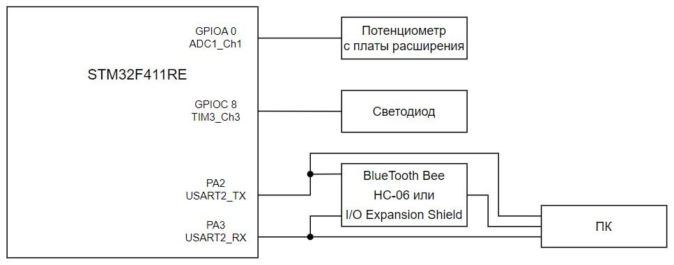

:toc: macro
:stem:

include::Titul_Lab1.adoc[]

toc::[]

== Требования к разработке проекта

В данном проекте необходимо измерять напряжение с потенциометра и, используя значение напряжения, управлять ярокстью светодиода за счёт модуля PWM.

Общие требования к курсовому проекту представлены в таблице 1.

.Требования к курсовому проекту
[cols="1,1"]
|===
|Параметр/характеристика |Требование

|Отладочная плата
|XNUCLEO-F411RE

|Объект и характеристика для измерения
|Напряжение с потенциометра, установленного на плате расширения Accessories Shield

|Способ измерения напряжения
|Встроенный АЦП

|Период измерения
|50 мс

|Способ получения кода
|Механизм DMA

|Точность измерения
|Не менее 0,01 В

|Способ передачи значений
|По беспроводному интерфейсу через модуль BlueTooth Bee HC-06 или I/O Expansion Shield

|Способ общения с платой расширения
|USART2

|Архитектура
|В виде UML диаграммы

|Требование к приложению
|Язык C++ с использованием компилятора ARM 8.40.2 и использование FreeRTOS
|===

К измеренному напряжению должен быть применен цифровой фильтр вида:

stem:["tau" = int ((1-e^(-"dt"/("R"*"C")), "RC" > 0 sec), (1, RC = 0 sec));] 

stem:["FilteredValue" = "OldValue" + ("Valu"e" - "OldValue") * "tau"] ,

где stem:["dt"] - 100 мс; +
stem:[Value] – текущее нефильтрованное измеренное значение напряжения; +
stem:[OldValue] - предыдущее фильтрованное значение.

Для управления яркостью светодиода должен использоваться модуль PWM. Светодиод находится на порту PortC.8.

Формат вывода: +
"Напряжение: " X.XXX [V].

== Анализ требований к разработке

В требованиях указан период измерения 50 мс, при этом цифровой фильтр должен работать с периодом 100 мс. Чтобы решить разницу с периодом, будет находиться среднее арифметическое двух измерений и потом их фильтровать.

Для передачи данных по беспроводному интерфейсу будет использован модуль Bluetooth Bee HC-06, модуль работает через USART2 и чтобы его туда подключить надо установить перемычку на JP4 в _B_ и _C_. 

Для преобразования на АЦП напряжения с переменного резистора, расположенного на плате расширения, будет использоваться формула:

stem:["VoltageValue" = ("AdcCodeValue" * ("MaxVoltage"-"MinVoltage")) / ("MaxAdcCode"-"MinAdcCode") + "Offset",]
 
где stem:["AdcCodeValue"] - текущее измеренное значение кода с 12 битного АЦП; +
stem:["MaxVoltage"] – максимальное значение напряжения, которое может быть установлено потенциометром; +
stem:["MinVoltage"] – минимальное значение напряжения, которое может быть установлено потенциометром; +
stem:["MaxAdcCode"] - максимальное значение кода АЦП, оно соответвует MaxVoltage; +
stem:["MinAdcCode"] - минимальное значение кода, оно соответвует MinVoltage; +
stem:["Offset"] - отклонение от нуля.

Значения stem:["MaxVoltage"] и stem:["MinVoltage"] можно измерить вольтметром, при крайних положениях потенциометра.

Чтобы обеспечить требуемую точность измерения напряжения не менее 0,01 В, необходимо соблюдать точность в формулах и иметь АЦП нужной точности. В данном случае используется 
12-битное АЦП, его точность расчитывается по формуле:

stem:["Accuracy" = 1 / ("MaxAdcCode"-"MinAdcCode") * ("MaxVoltage"-"MinVoltage").]
 
Его значение максимально при stem:[("MaxAdcCode" = 4095)], stem:[("MinAdcCode" = 0)], stem:[("MaxVoltage" = 3,3 В)], stem:[("MinVoltage" = 0 В)] и оно равняется stem:["Accuracy"=0,0008].

Для определения значения с PWM, а значения регистра TIM3_CCR (страница 325), будет использоваться формула:

stem:["CCRValue" = "VoltageValue" / ("MaxVoltage"-"MinVoltage") * ("ARRValue+1)",]

где stem:["ARRValue"] - заранее заданное значение регистра TIM3_ARR; +

== Архитектура приложения

Общая структура проекта представлена на рисунке 1.

.Блок-схема проекта

Описание блоков, необходимых для реализации проекта, представлено в таблице 2.

.Описание блоков с рисунка 1
[cols="1,1"]
|===
|Блок |Описание

|STM32F411RE
|STM32F411RE с ядром Cortex-M4 предназначен для управления периферийными устройствами. Содержит микропроцессор, ОЗУ и ПЗУ. Есть встроенный 12битный АЦП, он будет использоваться для измерения  напряжения с потенциометра на плате расширения  Accessories Shield

|Потенциометр на плате расширения
|Он необходим для изменения напряжения, а также для измерения напряжения с него.

|Светодиод
|Подключен на ту же линию, где находиться PWM

|Bluetooth Bee HC-06
|Модуль Bluetooth Bee HC-06 подключается по UART к разъемам RX и TX. Обеспечивает передачу данных по беспроводному интерфейсу

|Способ получения кода
|Механизм DMA

|ПК
|Персональный компьютер, на котором есть терминал для вывода данных с микроконтроллера
|===