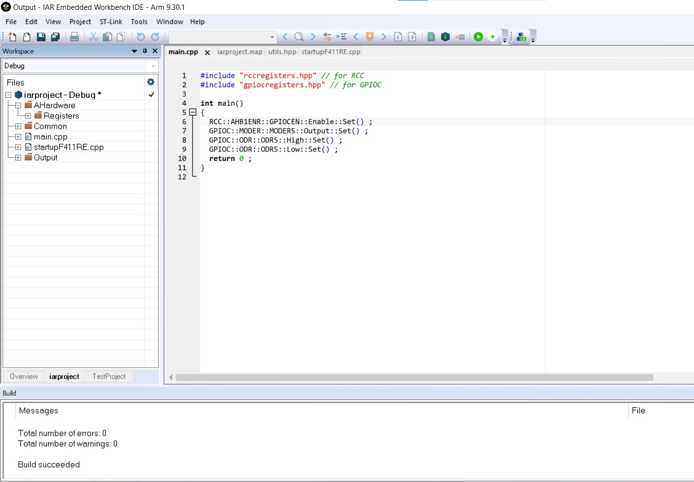
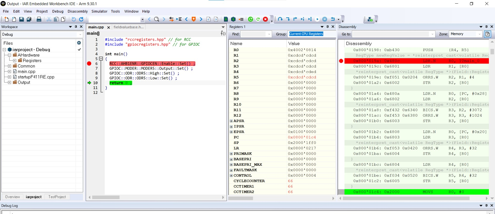

[.text-center]
Министерство науки и высшего образования Российской Федерации Федеральное государственное образовательное учреждение высшего образования
«Южно-Уральский государственный университет» (Национальный исследовательский университет)

[.text-center]
Высшая школа электроники и компьютерных наук Кафедра «Информационно-измерительная техника»

[.text-center]
дисциплина: 1.Ф.П1.06 (Программное обеспечение измерительных процессов)

[.text-center]
Отчет по лабороторной работе №1 +
на тему "Запуск программного обеспечения на микроконтроллере" 

[.text-right]
Работу принял, доцент +
___/ С.В. Колодий / +
___2023 г.

[.text-right]
Автор работы +
студент группы КЭ-413 +
___/ А.В. Московцев / +
___2023 г.

[.text-center]
Челябинск 2023

---
== Оглавление

<<1. Задание 1>>

<<2. Задание 2>>

<<3. Задание 3>>

== Задание 1

После создания проекта с main.cpp, туда был добавлен файл startup.cpp. Далее создадим папки AbstractHardware/Registers/Filed Values, Common. Папка AbstractHardware содержит файлы для работы с регистрами, аппаратурой и периферией. Common

Размер стека (Stack) установили 0x2000 и кучи (Heap) можно установить 0, так как динамическая память не будет использоваться.

.Установленные стек и куча
image::Stack and Heap.jpg[]

Скопировали содержимое папки Registers и Common с проекта преподавателя в свою папку.

.main.cpp
----
#include "rccregisters.hpp" // for RCC
#include "gpiocregisters.hpp" // for GPIOÑ

int main()
{  
  RCC::AHB1ENR::GPIOCEN::Enable::Set() ;
  GPIOC::MODER::MODER5::Output::Set() ;
  GPIOC::ODR::ODR5::High::Set() ;
  GPIOC::ODR::ODR5::Low::Set() ;
  return 0 ;
}

----

== Задание 2

Скомпоновали программу и откомпилировали.

.Откомпилорованный и скомпанованный проект

После загрузили программу в симмуляторе, установили точку остановы в строчку 6 и прошлись с отладчиком. Результат представлен на рисунке 3.

.Результат пошаговой отладки программы в симмуляторе

Настроили Debugger на отладку через StLink, подключили микроконтроллер к компьютеру и загрузили программу в плату. Выполнили пошаговую отладку, начиная с сторчки 6. Шестая строчка кода запускает тактирование порта C, седьмая отправляет порт С.5 на вывод, следующая, седьмая строчка кода включает светодиод, восьмая выключает его, девятая строчка завершает функцию main(), возвращая 0.

== Задание 3

Включили анализатор стека в Linker'е (Enable stack usage analysis).

.Включить/отключить функцию анализатор стека
image::analyze_stack.jpg[]

В map файле появилась область, указывающая на то, сколько было занято в стеке, в данном случае 16 байтов. Кроме того, в map файле указываются адреса переменных и функций, какой размер они имеют, к какому типу и сегменту они относятся, ошибки и предупреждения, по какому адресу начинается и заканчивается ROM и RAM, диапазон неиспользованных адресов.