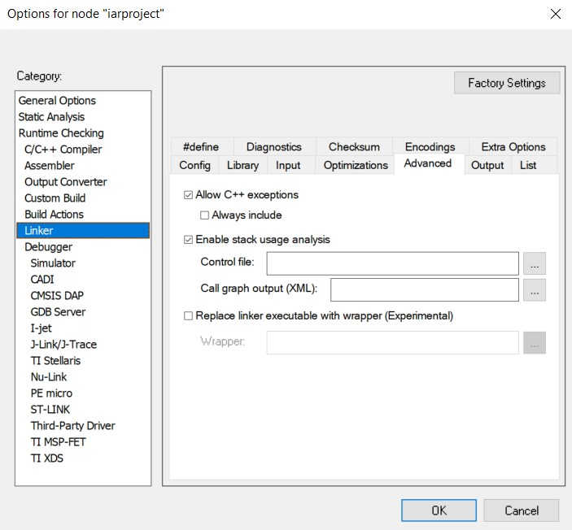

:toc: macro

include::Titul_Lab1.adoc[]

toc::[]

== Задание 1

=== Задачи

. Создать проект C++ c main.cpp

. Подключить к проекту файл cstartup.cpp

. Создать папки AbstractHardware/Registers/FiledValues, Common

. Создать структуру проекта в соотвествии со структурой папок

. Настроить STACK, HEAP

. Скопировать проект преподавателя

. Скопировать содержимое папки из папки AHardware/Registers и Common с проекта преподавателя в свою папку

. Написать программу в main.cpp

=== Выполнение

После создания проекта с main.cpp, туда был добавлен файл startup.cpp. Далее создадим папки AbstractHardware/Registers/Filed Values, Common. Папка AbstractHardware содержит файлы для работы с регистрами, аппаратурой и периферией. Common

Размер стека (Stack) установили в 0x1000 и кучи (Heap) можно установить в 0, так как динамическая память не будет использоваться.

.Установленные стек и куча
image::Stack and Heap.jpg[]

Скопировали содержимое папки Registers и Common с проекта преподавателя в свою папку.

.main.cpp

[source,cpp]
----
#include "rccregisters.hpp"
#include "gpiocregisters.hpp"

int main()
{
RCC::AHB1ENR::GPIOCEN::Enable::Set();
GPIOC::MODER::MODER5::Output::Set();
GPIOC::ODR::ODR5::High::Set();
GPIOC::ODR::ODR5::Low::Set();
return 0;
}
----

== Задание 2

=== Задачи

. Откомпилировать и отлинковать программу

. Загрузить программу в симуляторе

. Сделать пошаговую отладку

. Настроить Debugger на отладку через StLink

. Подключить плату к компьютеру

. Загрузить программу в плату

. Выполнить пошаговую отладку

. Описать полученный результат

=== Выполнение

Скомпоновали программу и откомпилировали.

.Откомпилорованный и скомпанованный проект
image::Откомилированный и скомпанованный проект.jpg[]

После загрузили программу в симмуляторе, установили точку остановы в строчку 6 и прошлись с отладчиком. Результат представлен на рисунке 3.

.Результат пошаговой отладки программы в симмуляторе
image::Sim.jpg[]

Настроили Debugger на отладку через StLink, подключили микроконтроллер к компьютеру и загрузили программу в плату. Выполнили пошаговую отладку, начиная с строчки 6. Шестая строчка кода запускает тактирование порта C, седьмая отправляет порт С.5 на вывод, следующая, седьмая строчка кода включает светодиод, восьмая выключает его, девятая строчка завершает функцию main(), возвращая 0.

== Задание 3

=== Задачи

. Запустить анализатор стека. Узнать рекомендуемый размер стека.

. Изменить в проекте размер стека на рекомендуемый

. Создать map файл

. Описать что написано в map файле

. Поставить размер кучи HEAP в 0. Объяснить почему так можно сделать. И почему STACK нельзя

. Добавить проект в Git и сделать синхронизацию с GitHub

. Сделать отчет по каждому пункту каждого задания в файле .adoc. Выложить файл в GitHub

. Прислать ссылку на GitHub преподавателю для проверки

=== Выполнение

Включили анализатор стека в Linker'е (Enable stack usage analysis).

.Включить/отключить функцию анализатор стека

В map файле появилась область, указывающая на то, сколько было занято в стеке, в данном случае 16 байт (0x10). Кроме того, в map файле указываются адреса переменных и функций, какой размер они имеют, к какому типу и сегменту они относятся, ошибки и предупреждения, по какому адресу начинается и заканчивается ROM и RAM, диапазон неиспользованных адресов.
Кучу можно поставить в 0, так как в данном случае не использовалась динамическая память. Со стеком можно поступить так же, то есть поставить в 0, так как хватит объема памяти регистров.

== Выводы

В данной работе был создан проект, была проведена пошаговая отладка программы через STLink с микроконтролером и через симмулятор, так же было описано содержимое map файла. Так же была проведена работа со стеком и кучей, которые в данном случае можно поставить в 0.