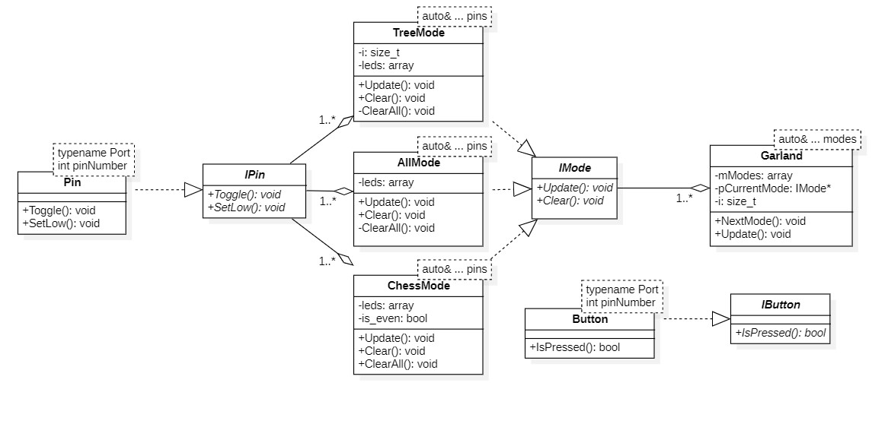

:toc: macro

include::Titul_Lection11.adoc[]

toc::[]

== Задачи

Написать код для работы переключения режима по кнопке, составить UML-диаграмму классов данной программы.

== UML-диаграмма

UML – унифицированный язык моделирования (Unified Modeling Language) – это система обозначений, которую можно применять для объектно-ориентированного анализа и проектирования.

.UML-диаграмма классов

== Код

.ipin.h

[source,cpp]
----
#ifndef IPIN
#define IPIN

class IPin
{
public:
  virtual void Toggle() const = 0;
  virtual void SetLow() const = 0;
};

#endif
----

.pin.h

[source,cpp]
----
#ifndef PIN
#define PIN

#include "ipin.h"

template<typename Port, int pinNumber>
class Pin : public IPin
{
public:
void Toggle() const override
{
  Port::ODR::Toggle(1 << pinNumber);  
}
void SetLow() const override
{
  Port::ODR::Write(Port::ODR::Get() & ~(1 << pinNumber));
}
};

#endif
----

.imode.h

[source,cpp]
----
#ifndef IMODE
#define IMODE

class IMode
{
public:
  virtual void Update() = 0;
  virtual void Clear() = 0;
};

#endif
----

.allmode.h

[source,cpp]
----
#ifndef ALLMODE
#define ALLMODE

#include "imode.h"
#include <array>

template<auto& ... pins>
class AllMode : public IMode
{
public:
void Update() override
{  
  for(auto it: leds)
  {
    it->Toggle();
  }
}

void Clear() override
{
  ClearAll();
}
private:
  std::array<IPin*, sizeof ... (pins)> leds = {static_cast<IPin*> (&pins)...};
  void ClearAll()
  {
    for(auto it: leds)
    {
      it->SetLow();
    }
  }
};

#endif
----

.treemode.h

[source,cpp]
----
#ifndef TREEMODE
#define TREEMODE

#include "imode.h"
#include <array>

template<auto& ... pins>
class TreeMode : public IMode
{
public:
void Update() override
{  
  leds[i++]->Toggle();
  if(i == leds.size())
  {
    i = 0;
  }
}
void Clear() override
{
  i=0;
  ClearAll();
}
private:
  std::size_t i = 0;
  std::array<IPin*, sizeof ... (pins)> leds = {static_cast<IPin*> (&pins)...};
  void ClearAll()
  {
    for(auto it: leds)
    {
      it->SetLow();
    }
  }
};

#endif
----

.chessmode.h

[source,cpp]
----
#ifndef CHESSMODE
#define CHESSMODE

#include "imode.h"
#include <array>

template<auto& ... pins>
class ChessMode : public IMode
{
public:
  void Update() override
  {
    ToggleAll();
  }
  void Clear() override
  {
    ClearAll();
    SetOdd();
  }
private:
  std::array<IPin*, sizeof ... (pins)> leds = {static_cast<IPin*> (&pins)...};
  void SetOdd()
  {
    for(int i = 1; i < leds.size(); i+=2)
    {
      leds[i]->Toggle();
    }
  }
  void ClearAll()
  {
    for(auto it: leds)
    {
      it->SetLow();
    }
  }
  void ToggleAll()
  {
    for(auto it: leds)
    {
      it->Toggle();
    }
  }
};

#endif
----

.garland.h

[source,cpp]
----
#ifndef GARLAND
#define GARLAND

#include "imode.h"
#include <array>

template<auto& ... modes>
class Garland
{
public:
void NextMode()
{
  pCurrentMode = mModes[i];
  pCurrentMode->Clear();
  i++;
  if(i == mModes.size())
  {
    i = 0;
  }
}
void Update()
{
  pCurrentMode->Update();
}
private:
  std::array<IMode*, sizeof ... (modes)> mModes = {static_cast<IMode*> (&modes)...};
  IMode* pCurrentMode = mModes[0];
  std::size_t i = 0;
};

#endif
----

.ibutton.h

[source,cpp]
----
#ifndef IBUTTON
#define IBUTTON

class IButton
{
public:
  virtual bool IsPressed() = 0;
};

#endif
----

.button.h

[source,cpp]
----
#ifndef BUTTON
#define BUTTON

#include "ibutton.h"
#include <array>

template<typename Port, int pinNumber>
class Button : public IButton
{
public:
bool IsPressed() override
{
  if(((Port::IDR::Get()&(1 << pinNumber))==0) && (isSet))
  {
    isSet = false;
  } else if(((Port::IDR::Get()&(1 << pinNumber))==(1 << pinNumber)) && (!isSet))
  {
    isSet = true;
    return true;
  }
  return 0;
}
private:
  bool isSet = true;
};

#endif
----

.main.cpp

[source,cpp]
----
#include "rccregisters.hpp" // for RCC
#include "gpioaregisters.hpp" // for GPIOA
#include "gpiocregisters.hpp" // for GPIOC
#include "pin.h"
#include "treemode.h"
#include "chessmode.h"
#include "allmode.h"
#include "garland.h"
#include "button.h"

std::uint32_t SystemCoreClock = 16'000'000U;

void delay(int cycles)
{
  for(int i = 0; i < cycles; ++i)    
  {   
    asm volatile("");
  }    
}

Pin<GPIOC, 5> pin1;
Pin<GPIOC, 8> pin2;
Pin<GPIOC, 9> pin3;
Pin<GPIOA, 5> pin4;

Button<GPIOC, 13> btn;

AllMode<pin1, pin2, pin3, pin4> all; //Создание объекта класса режим "все"
TreeMode<pin1, pin2, pin3, pin4> el; //Создание объекта класса режим "елочки"
ChessMode<pin1, pin2, pin3, pin4> chess; //Создание объекта класса шахматный режим
Garland<all, el, chess> garland; //Создание объекта класса гирлянда

int main()
{
  RCC::AHB1ENR::GPIOAEN::Enable::Set(); //Подача тактирования на порт A
  RCC::AHB1ENR::GPIOCEN::Enable::Set(); //Подача тактирования на порт C
  //GPIOC::MODER::MODER13::Input::Set(); //Порт C.13 на ввод
  GPIOA::MODER::MODER5::Output::Set(); //Порт A.5 на вывод
  GPIOC::MODER::MODER5::Output::Set(); //Порт С.5 на вывод
  GPIOC::MODER::MODER8::Output::Set(); //Порт С.8 на вывод
  GPIOC::MODER::MODER9::Output::Set(); //Порт С.9 на вывод

  for(;;)
  { 
    garland.Update();
    if(btn.IsPressed())
    {
      garland.NextMode();
    }
    delay(1000000);
  }
  
  return 1;
}
----

Булевый метод _IsPressed()_ класса Button проверяет, нажата ли кнопка, если да, то после её отжатия должен переключиться режим.

Метод _NextMode()_ переключает режимы.

Метод _Clear()_ выключает все светодиоды, чтобы они не накладывались в следующем режиме, и сбрасывает их, например, в классе TreeMode это нужно, чтобы счёт цикла шёл заново, при повторном переключении на данный режим.

В результате получилось следующее

.Работа программы
video::Video/Perekl_leds.mp4[]

== Выводы

В данной работе было сделана UML-диаграмма классов программы для моргания светодиодов в различных режимах и написан код этой программы с использованием классов.