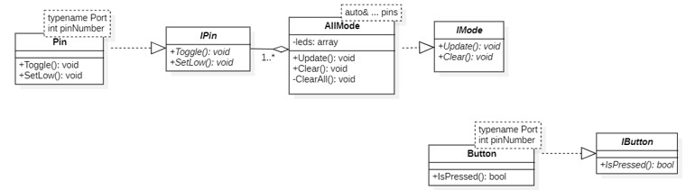

:toc: macro

include::Titul_Lection12.adoc[]

toc::[]

== Задачи

Рассмотреть для чего используются таймеры, их виды. Написать код для переключения светодиодов с периодом 500 мс, при нажатии на кнопку период увеличивается на 100 мс вплоть до 1000 мс и после всё по кругу, использовать таймер TIM5.

== Таймеры

Таймеры нужны для точного отсчета времени, измерения частоты/периода, генерации ШИМ (широтно-импульсной модуляции) и переменных сигналов. Всего есть следующие виды таймеров:

* SYSTEM TIMER. Также существуют системный таймер SysTick таймер и Watchdog таймер.

* TIM1. Это расширенный 16 битный таймер автоматической перезагрузки, приводимого в действие
программируемым прескалером.

* TIM2–TIM5. 16-разрядные (TIM3, TIM4) или 32-разрядные (TIM2, TIM5) таймеры общего назначения автоматической перезагрузки, приводимого в действие
программируемым прескалером.

*TIM9–TIM11. Самые обычные 16-разрядные таймеры общего назначения TIM9/10/11 автоматической перезагрузки, приводимого в действие программируемым прескалером.

=== TIM2 и TIM5

Таймеры 32 битные (то есть могут считать до 2^32), умеют работать:

* с инкрементальными энкодерами и датчиками Холла;

* несколько таймеров можно синхронизировать между собой.

Таймеры могут использоваться для:

* захвата сигнала (Защелкивать значение, когда на выводе порта например 0 сменился на 1);

* сравнения (Считать до значения в регистре сравнения и установить/сбросить/переключить вывод порта);

* генерации ШИМ (Генерировать прямоугольный сигнал с различной скважностью на вывод порта);

* генерации одиночного импульса.

*Для организации задержки*:

. Подать тактирование на модуль таймера​

. Установить делитель частоты для таймера в регистре PSC​

. Установить источник генерации прерываний по событию переполнение с помощью бита URS в регистре CR1​

. Установить значение до которого счетчик будет считать в регистре перезагрузке ARR​

. Скинуть флаг генерации прерывания UIF по событию в регистре SR​

. Установить начальное значение счетчика в 0 в регистре CNT​

. Запустить счетчик с помощью бита EN в регистре CR1​

. Проверять, пока не будет установлен флаг генерации прерывания по событию UIF в регистре SR​

. Как только флаг установлен, остановить счетчик, сбросить бит EN в регистре CR1. Сбросить флаг генерации прерывания UIF по событию в регистре SR

== Моргание светодиодами с использованием задержки в виде TIM5

.UML-диаграмма классов, используемых для данного кода

.ipin.h

[source,cpp]
----
#ifndef IPIN
#define IPIN

class IPin
{
public:
  virtual void Toggle() const = 0;
  virtual void SetLow() const = 0;
};

#endif
----

.pin.h

[source,cpp]
----
#ifndef PIN
#define PIN

#include "ipin.h"

template<typename Port, int pinNumber>
class Pin : public IPin
{
public:
void Toggle() const override
{
  Port::ODR::Toggle(1 << pinNumber);
}
void SetLow() const override
{
  Port::ODR::Write(Port::ODR::Get() & ~(1 << pinNumber));
}
};

#endif
----

.imode.h

[source,cpp]
----
#ifndef IMODE
#define IMODE

class IMode
{
public:
  virtual void Update() = 0;
  virtual void Clear() = 0;
};

#endif
----

.allmode.h

[source,cpp]
----
#ifndef ALLMODE
#define ALLMODE

#include "imode.h"
#include <array>

template<auto& ... pins>
class AllMode : public IMode
{
public:
void Update() override
{
  for(auto it: leds)
  {
    it->Toggle();
  }
}

void Clear() override
{
  ClearAll();
}
private:
  std::array<IPin*, sizeof ... (pins)> leds = {static_cast<IPin*> (&pins)...};
  void ClearAll()
  {
    for(auto it: leds)
    {
      it->SetLow();
    }
  }
};

#endif
----

.ibutton.h

[source,cpp]
----
#ifndef IBUTTON
#define IBUTTON

class IButton
{
public:
  virtual bool IsPressed() = 0;
};

#endif
----

.button.h

[source,cpp]
----
#ifndef BUTTON
#define BUTTON

#include "ibutton.h"
#include <array>

template<typename Port, int pinNumber>
class Button : public IButton
{
public:
bool IsPressed() override
{
  if(((Port::IDR::Get()&(1 << pinNumber))==0) && (isSet))
  {
    isSet = false;
  } else if(((Port::IDR::Get()&(1 << pinNumber))==(1 << pinNumber)) && (!isSet))
  {
    isSet = true;
    return true;
  }
  return 0;
}
private:
  bool isSet = true;
};

#endif
----

.main.c

[source,cpp]
----
#include "rccregisters.hpp" // for RCC
#include "gpioaregisters.hpp" // for GPIOA
#include "gpiocregisters.hpp" // for GPIOC
#include "tim5registers.hpp" // for TIM5
#include "pin.h" // for pins
#include "allmode.h" // for all
#include "button.h" // for button

std::uint32_t SystemCoreClock = 16'000'000U;

extern "C" {
int __low_level_init(void)
{
  RCC::APB1ENR::TIM5EN::Enable::Set();
  return 1;
}
}

using tMsec = std::uint32_t;

void delay(tMsec period)
{
  const auto psc = static_cast<uint32_t>(SystemCoreClock/1000-1U);
  TIM5::PSC::Write(psc);
  TIM5::CR1::URS::Value1::Set();
  TIM5::ARR::Write(period);
  TIM5::SR::UIF::Set(0);
  TIM5::CNT::Write(0);  
  TIM5::CR1::CEN::Enable::Set();
  while(TIM5::SR::UIF::Get() == 0)
  {
  }
  TIM5::CR1::CEN::Disable::Set();
  TIM5::SR::UIF::Set(0);
}

Pin<GPIOC, 5> pin1;
Pin<GPIOC, 8> pin2;
Pin<GPIOC, 9> pin3;
Pin<GPIOA, 5> pin4;

Button<GPIOC, 13> btn;

AllMode<pin1, pin2, pin3, pin4> all; //Создание объекта класса режим "все"

  int main()
{
  RCC::AHB1ENR::GPIOAEN::Enable::Set(); //Подача тактирования на порт A
  RCC::AHB1ENR::GPIOCEN::Enable::Set(); //Подача тактирования на порт C
  //GPIOC::MODER::MODER13::Input::Set(); //Порт C.13 на ввод
  GPIOA::MODER::MODER5::Output::Set(); //Порт A.5 на вывод
  GPIOC::MODER::MODER5::Output::Set(); //Порт С.5 на вывод
  GPIOC::MODER::MODER8::Output::Set(); //Порт С.8 на вывод
  GPIOC::MODER::MODER9::Output::Set(); //Порт С.9 на вывод

  tMsec period = 500U;
  for(;;)
  { 
    all.Update();
    if(btn.IsPressed())
    {
      period = (period < tMsec(1000)) ? (period + tMsec(100U)) : tMsec(500U) ;
    }
    delay(period);
  }
  
  return 1;
}
----

.Работа кода
video::Video/Result_TIM5.mp4[]

== Выводы

В данной работе были рассмотрены виды таймеров, описан функционал таймеров TIM2 и TIM5, и как с ними работать в режиме счетчика. По итогу был написан код для работы таймера TIM5 для переключения светодиодов с периодом 500 мс, при нажатии на кнопку период увеличивается на 100 мс вплоть до 1000 мс, и после следующего нажатия период становиться 500 мс и всё начинается заново.